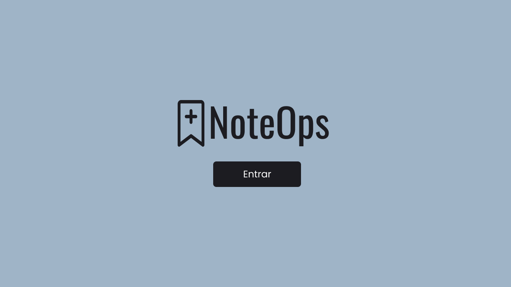
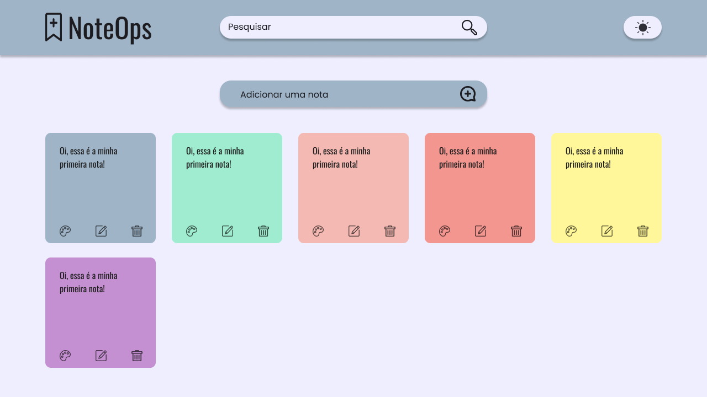

# NoteOps - Uma plataforma para suas anotações

O NoteOps é um site onde você pode adicionar suas notas, listas de tarefas e lembretes para não esquecer nada importante. Este README fornece informações sobre o projeto, suas funcionalidades e como utilizá-lo em seu ambiente local.






## 🔨 Funcionalidades do projeto

Neste estágio inicial de desenvolvimento, o NoteOps possui as seguintes funcionalidades:

- Tela de Login;
- Formulário para criar uma nova nota;
- Opções de cores para as notas;
- Editar nota;
- Deletar nota;
- Buscar nota.

## ✔️ Técnicas e tecnologias utilizadas

O projeto NoteOps utiliza as seguintes tecnologias e bibliotecas:

- `React` - Framework JavaScript;
- `Vite` - Build tool para desenvolvimento rápido;
- `React Router` - Biblioteca de roteamento para navegação em aplicações React;
- `MaterialUI` - Biblioteca de ícones.

## 🛠️ Abrir e rodar o projeto

Para executar o projeto em seu ambiente local, siga estas etapas:

1. Certifique-se de ter o Node.js instalado em sua máquina.
2. Baixe o repositório do projeto.
3. Extraia os arquivos para uma pasta de sua preferência.
4. Navegue até a pasta em questão via terminal (cmd):

    ```bash
    cd noteops
    ```

5. Instale as dependências usando o npm:

    ```bash
    npm install
    ```

6. Inicie o projeto localmente:

    ```bash
    npm run dev
    ```

7. Abra seu navegador e acesse a URL exibida no seu terminal para visualizar o projeto.
